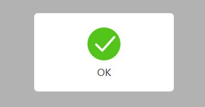
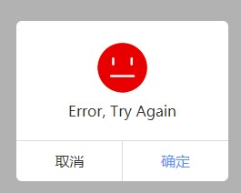

# pconfirm
This is a vue dialog plugin for ES5.

## usage
```js
/**
 * Vue Dialog plugin
 * Dependent file: vue, pconfirm.css, pconfirm.js
 * Instructions: Vue.use(Pconfirm), Pconfirm.show({params})
 * params:
 * @param {String} icon. Icon path to display(Required)
 * @param {String} desc. Prompt text to be displayed(Required)
 * @param {Boolean} cancelShow. Whether to show the cancel button
 * @param {Boolean} autoDisappear. Whether to disappear automatically
 * @param {Function} sure. Click OK callback function
 * @param {Function} cancel. Click to cancel callback function
 */
```

## Run screenshot

